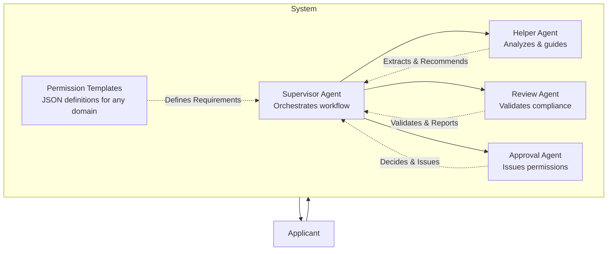
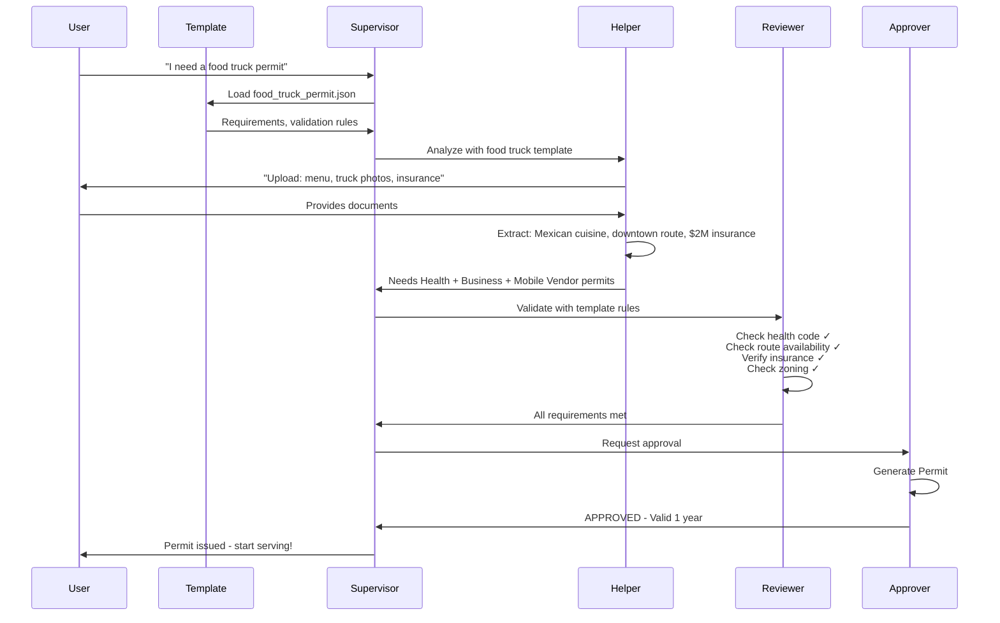

# PermitPilot - Product Requirements Document

## AI-Powered Multi-Agent System for Universal Government Permissioning

## Table of Contents

- [The Problem](#the-problem)
  - [Universal Pain Points in Government Permissioning](#universal-pain-points-in-government-permissioning)
  - [The Scope of the Challenge](#the-scope-of-the-challenge)
- [The Solution](#the-solution)
  - [Core Architecture](#core-architecture)
  - [How It Works Across Different Domains](#how-it-works-across-different-domains)
- [System Architecture](#system-architecture)
  - [High-Level Design](#high-level-design)
  - [Multi-Agent Workflow](#multi-agent-workflow)
- [Agent Specifications](#agent-specifications)
  - [1. Supervisor Agent](#1-supervisor-agent)
  - [2. Helper Agent](#2-helper-agent)
  - [3. Review Agent](#3-review-agent)
  - [4. Approval Agent](#4-approval-agent)
- [Permission Template System](#permission-template-system)
  - [What Templates Define](#what-templates-define)
  - [Template Example: Food Truck Permit](#template-example-food-truck-permit)
  - [Why Templates Enable Universal Scaling](#why-templates-enable-universal-scaling)
- [Core Platform Features](#core-platform-features)
  - [1. Universal Document Intelligence](#1-universal-document-intelligence)
  - [2. Intelligent Requirement Determination](#2-intelligent-requirement-determination)
  - [3. Proactive Guidance System](#3-proactive-guidance-system)
  - [4. Multi-Department Coordination](#4-multi-department-coordination)
  - [5. Conversational Interface](#5-conversational-interface)
  - [6. Transparency & Trust](#6-transparency--trust)
  - [7. Autonomous Approval Engine](#7-autonomous-approval-engine)
- [Data Model](#data-model)
  - [Shared Agent State](#shared-agent-state)
  - [Permission Template Schema](#permission-template-schema)
- [Technology Stack](#technology-stack)
  - [Frontend](#frontend)
  - [Backend](#backend)
  - [Infrastructure](#infrastructure)
  - [Documentation & Developer Experience](#documentation--developer-experience)
- [User Experience](#user-experience)
  - [Application Journey](#application-journey)
  - [Visual Design Principles](#visual-design-principles)
- [Competitive Advantages](#competitive-advantages)
  - [vs. Traditional Form-Filling Tools](#vs-traditional-form-filling-tools)
  - [vs. Government Online Portals](#vs-government-online-portals)
  - [vs. Point Solutions](#vs-point-solutions)
  - [vs. Generic AI Chatbots](#vs-generic-ai-chatbots)
- [Extension Opportunities](#extension-opportunities)
  - [Near-Term Enhancements](#near-term-enhancements)
  - [Long-Term Vision](#long-term-vision)
- [Technical Implementation Notes](#technical-implementation-notes)
  - [Agent Implementation](#agent-implementation)
  - [Template System](#template-system)
  - [LangGraph Workflow](#langgraph-workflow)
- [Conclusion](#conclusion)

---

PermitPilot is a universal multi-agent AI platform that automates government permission processes across any regulatory domain. The system transforms bureaucratic workflows—from business licenses to event permits to health certifications—from weeks-long manual processes into intelligent, automated experiences that complete in days.

**Core Innovation:** Unlike traditional form-filling assistants, PermitPilot's specialized AI agents actually process and approve applications like government staff would, handling everything from document analysis to multi-department coordination to autonomous permit issuance.

---

## The Problem

### Universal Pain Points in Government Permissioning

**For Citizens & Businesses:**
- No clear guidance on requirements across 50+ permission categories
- 65% of applications rejected on first submission due to missing information
- Average 21-day processing time with multiple department handoffs
- Limited availability (business hours only, often in-person required)
- Inconsistent decisions based on which staff member reviews applications
- No proactive warnings about common mistakes before submission

**For Government Agencies:**
- Manual processing requiring 45 minutes average per application
- Paper-based workflows with disconnected departmental systems
- Staff bottlenecks during peak seasons
- High error rates leading to compliance issues
- No standardization across departments or jurisdictions
- Serial handoffs between departments causing delays

**Economic Barriers:**
- Project delays due to permission bottlenecks
- Small businesses disproportionately affected by permitting complexity
- Innovation stifled by barriers to entry
- Lost economic activity from delayed approvals

### The Scope of the Challenge

Government permissions span diverse regulatory domains, each with unique requirements but similar bureaucratic patterns:

- Construction & Building Permits
- Business Licenses & Registrations
- Event & Public Space Permits
- Food Service & Health Certifications
- Liquor & Alcohol Licenses
- Professional Licensing
- Environmental Permits
- Special Use Permits
- Vendor & Mobile Business Permits
- Childcare & Facility Licenses

Each permission type involves document submission, multi-department review, compliance validation, and approval decisions—all currently manual processes.

---

## The Solution

PermitPilot is a **domain-agnostic multi-agent AI system** that adapts to any government permission workflow through template-based intelligence.

### Core Architecture

**Template-Based Intelligence:**
- Permission requirements defined in structured JSON templates
- AI agents adapt their reasoning to loaded template specifications
- Add new permission types by creating templates, not writing code
- Universal compliance framework works across all regulatory domains

**Multi-Agent Orchestration:**
- 4 specialized agents handle distinct workflow stages
- Supervisor Agent coordinates the entire permission lifecycle
- Agents share state and context through LangGraph
- Autonomous processing from submission to approval

**Full-Circle Automation:**
- Document analysis and requirement determination
- Application package generation with proactive guidance
- Multi-department compliance validation
- Autonomous approval decisions and permit issuance

### How It Works Across Different Domains

**Example: Restaurant Business License**
1. Applicant uploads lease agreement, menu, floor plan
2. Helper Agent extracts business details and determines required permits
3. Review Agent validates zoning, health code, fire safety, ADA compliance
4. Approval Agent issues license or requests additional documentation

**Example: Street Fair Event Permit**
1. Applicant submits event description, expected attendance, proposed route
2. Helper Agent identifies required permits: special event, street closure, noise variance
3. Review Agent validates route logistics, noise ordinances, safety plans, insurance
4. Approval Agent issues permit with conditions or modification requests

**Example: Home Daycare License**
1. Applicant provides facility photos, curriculum, background checks
2. Helper Agent determines needs: childcare license, health inspection, fire safety clearance
3. Review Agent validates staff ratios, facility requirements, safety compliance
4. Approval Agent issues license with inspection schedule

---

## System Architecture

### High-Level Design



**Architecture Principles:**

- **Template-driven configuration:** Add new permission types without code changes
- **4 specialized agents:** Each with universal reasoning capabilities adapted per template
- **Supervisor orchestration:** Intelligent coordination across any workflow
- **Full automation:** From submission to approval without human intervention
- **Shared state management:** Context preservation across all agents via LangGraph

---

### Multi-Agent Workflow



**Workflow Stages:**

1. **Intent Discovery:** Supervisor identifies permission type and loads appropriate template
2. **Analysis Phase:** Helper Agent extracts project details from documents
3. **Guidance Phase:** Helper Agent determines requirements and builds application package
4. **Submission Phase:** Complete application routed to review process
5. **Validation Phase:** Review Agent validates across multiple departments simultaneously
6. **Decision Phase:** Approval Agent issues permit, conditional approval, or rejection with specifics

---

## Agent Specifications

### 1. Supervisor Agent

**Role:** Universal workflow orchestrator and conversation manager

**Core Responsibilities:**
- Loads appropriate permission template based on user intent
- Routes requests to specialized agents based on workflow state
- Maintains conversation context and shared state across all agents
- Provides real-time status updates to user
- Handles errors and edge cases across all permission types
- Explains delegation decisions for transparency

**Template Intelligence:**
- Reads workflow stages from template (analysis → guidance → review → approval)
- Adapts routing logic to template-defined decision points
- Manages inter-agent coordination based on permission complexity
- Ensures proper sequencing of validation steps

**Why Universal:** Same orchestration logic works for any permission by following template structure

---

### 2. Helper Agent

**Role:** Applicant-facing expert that adapts to any permission domain

**Core Responsibilities:**
- Analyzes uploaded documents relevant to permission type
- Extracts domain-specific details based on template-defined fields
- Determines required permits using template's conditional logic
- Identifies missing documents from template checklist
- Provides proactive warnings from historical pattern database
- Generates complete application package with pre-filled forms

**Template-Driven Intelligence:**

**Document Understanding:**
- Extracts information based on template field specifications
- Adapts to document types: blueprints, leases, menus, photos, forms, certificates
- Provides confidence scores on extraction accuracy
- Handles multi-page documents and complex layouts

**Requirement Determination:**
- Reads conditional rules from template (IF-THEN logic)
- Applies domain-specific permit requirements
- Identifies all necessary sub-permits and supporting documents
- Calculates estimated fees and processing timelines

**Proactive Guidance:**
- Accesses permission-specific rejection pattern database
- Warns about common mistakes before submission
- Provides actionable recommendations to prevent rejections
- Examples:
  - "47% of food truck permits delayed by expired health permits—verify yours is current"
  - "68% of deck permits rejected for missing property survey"
  - "52% of event permits require additional security documentation"

**Application Package Generation:**
- Pre-fills forms using extracted data
- Creates checklist of all requirements
- Highlights missing items that need user action
- Provides document upload interface for gaps

**Why Universal:** Same extraction and reasoning engine adapts to any template's field definitions and conditional rules

---

### 3. Review Agent

**Role:** Multi-department compliance validator that adapts to any regulatory domain

**Core Responsibilities:**
- Validates compliance against template-defined codes and regulations
- Simulates multiple government departments reviewing in parallel
- Checks template-specified requirements (health, safety, zoning, licensing, etc.)
- Verifies documentation completeness and authenticity
- Cross-checks between departments to identify conflicts
- Generates detailed pass/fail reports with explanations

**Template-Driven Validation:**

**Multi-Department Simulation:**
- Template defines which departments must review
- Agents simulate each department's validation process simultaneously
- Parallel processing eliminates serial handoff delays
- Examples:
  - **Construction:** Building Dept + Electrical Dept + Zoning Dept + Fire Marshal
  - **Business License:** Zoning + Health Dept + Fire Marshal + Business Licensing
  - **Event Permit:** Police + Public Works + Parks Dept + Risk Management

**Compliance Checking:**
- Reads validation rules from template (code references, thresholds, requirements)
- Applies domain-appropriate compliance checks
- Validates against building codes, health codes, zoning regulations, safety standards
- Verifies licensing requirements and insurance coverage

**Conflict Detection:**
- Identifies issues between departments using template-defined inter-department rules
- Examples:
  - Fire code requirements conflicting with zoning setbacks
  - Health code occupancy limits vs. business plan capacity
  - Event route conflicting with scheduled construction

**Detailed Reporting:**
- Generates pass/fail status for each department
- Explains exactly what was validated and why
- Provides specific citations to applicable codes and regulations
- Lists any conditions or additional requirements needed

**Why Universal:** Same validation framework applies to any domain by reading compliance rules from templates

---

### 4. Approval Agent

**Role:** Final decision authority that issues any permission type

**Core Responsibilities:**
- Synthesizes all review findings from multiple departments
- Makes approve/conditional/reject determination based on template criteria
- Generates official permission document with unique identifier
- Calculates validity period based on template rules
- Issues permit instantly for approved cases
- Specifies exact additional requirements for conditional approvals
- Provides next steps and appeal information for rejections

**Template-Driven Decisions:**

**Decision Synthesis:**
- Evaluates all department review outcomes
- Applies template-defined approval criteria
- Determines if requirements are fully met, partially met, or not met
- Makes final determination: approved, conditional, or rejected

**Approval Outcomes:**

**Full Approval:**
- All validation checks passed
- Generates unique permit number using template prefix
- Sets validity period per template rules
- Issues official permit document immediately
- Example: "APPROVED - Permit #MFV-2025-8472, valid 12 months"

**Conditional Approval:**
- Minor documentation gaps or pending final inspection
- Specifies exact requirements needed for full approval
- Sets deadline for condition fulfillment
- Example: "CONDITIONAL - Submit fire marshal approval within 30 days for license issuance"

**Rejection:**
- Critical requirements not met or major violations found
- Provides detailed explanation of deficiencies
- Offers guidance on how to address issues
- Provides resubmission pathway
- Example: "REJECTED - Facility does not meet ADA accessibility requirements (sections 4.13, 7.2)"

**Permit Issuance:**
- Generates official permit with template-defined numbering scheme
- Includes all relevant details: validity dates, conditions, restrictions
- Provides digital document for download
- Records issuance in system for compliance tracking

**Why Universal:** Same decision logic applies to any permission by following template-defined approval criteria and permit specifications

---

## Permission Template System

### What Templates Define

Permission templates are JSON documents that encode domain expertise, allowing the system to understand and process any permission type without code changes.

**Template Components:**

**1. Basic Information**
- Permission type identifier
- Display name and category
- Description and purpose

**2. Required Documents**
- List of all documents needed
- Validation criteria for each document
- Display instructions for users

**3. Extraction Fields**
- Data points to extract from documents
- Field types (text, number, date, location, etc.)
- Validation rules for extracted data

**4. Sub-Permit Rules**
- Other permits required
- Conditional logic (when they're needed)
- Dependencies between permits

**5. Validation Rules**
- Which departments must review
- Specific checks each department performs
- Code references and compliance standards
- Threshold values and requirements

**6. Approval Criteria**
- Conditions for automatic approval
- Conditions for conditional approval
- Conditions for rejection
- Required thresholds and standards

**7. Permit Details**
- ID numbering scheme and prefix
- Validity period and renewal rules
- Fee structure
- Special conditions or restrictions

**8. Proactive Warnings**
- Common rejection patterns with frequency data
- Typical missing documents
- Compliance issues to watch for
- Best practice recommendations

### Template Example: Food Truck Permit

```json
{
  "permission_type": "food_truck_permit",
  "display_name": "Mobile Food Vendor Permit",
  "category": "business_licensing",
  "description": "Permit for operating a mobile food service vehicle",
  
  "required_documents": [
    {
      "name": "menu",
      "display": "Complete menu with pricing",
      "validation": "Must show food categories and allergen information"
    },
    {
      "name": "vehicle_photos",
      "display": "Photos of food truck (all sides)",
      "validation": "Must show current condition and all equipment"
    },
    {
      "name": "liability_insurance",
      "display": "General liability insurance certificate",
      "validation": "Minimum $2M coverage, city as additional insured"
    },
    {
      "name": "health_permit",
      "display": "Valid health department permit",
      "validation": "Must be current and match vehicle identification"
    }
  ],
  
  "extraction_fields": [
    {"field": "business_name", "type": "text", "required": true},
    {"field": "cuisine_type", "type": "category", "required": true},
    {"field": "operating_zones", "type": "location_array", "required": true},
    {"field": "operating_hours", "type": "schedule", "required": true},
    {"field": "insurance_coverage", "type": "currency", "required": true}
  ],
  
  "sub_permits": [
    {
      "type": "health_permit",
      "condition": "always_required",
      "display": "Mobile Food Service Health Permit"
    },
    {
      "type": "business_license",
      "condition": "always_required",
      "display": "General Business License"
    },
    {
      "type": "parking_permit",
      "condition": "if operating_zones includes metered_areas",
      "display": "Special Parking Permit for Metered Zones"
    }
  ],
  
  "validation_rules": [
    {
      "department": "health",
      "checks": [
        "Valid health permit for mobile food service",
        "Food handler certifications current for all staff",
        "Truck equipment passes health inspection standards",
        "Proper food storage and temperature control systems"
      ],
      "codes": ["Health Code Section 114381", "CalCode 113980-114437"]
    },
    {
      "department": "zoning",
      "checks": [
        "Operating zones are designated food truck areas",
        "No conflicts with brick-and-mortar business restrictions",
        "Distance requirements from schools met (500ft minimum)",
        "Parking duration limits observed"
      ],
      "codes": ["Zoning Code 12.22.C.27", "Municipal Code 42.00"]
    },
    {
      "department": "business",
      "checks": [
        "Business license current and valid",
        "Tax registration complete and verified",
        "No outstanding code violations",
        "Business entity properly registered with state"
      ],
      "codes": ["Business & Professions Code 16000-16100"]
    }
  ],
  
  "approval_criteria": {
    "auto_approve": {
      "conditions": [
        "All validation checks pass",
        "No special conditions apply",
        "Insurance coverage meets or exceeds minimum",
        "All sub-permits current and valid"
      ]
    },
    "conditional": {
      "conditions": [
        "Minor documentation gaps",
        "Pending final health inspection",
        "Insurance renewal needed within 30 days",
        "Additional operating zone approval needed"
      ]
    },
    "reject": {
      "conditions": [
        "Major health code violations",
        "Missing critical licenses",
        "Operating in prohibited zones",
        "Insurance coverage insufficient"
      ]
    }
  },
  
  "permit_details": {
    "id_prefix": "MFV",
    "validity_period_months": 12,
    "renewal_window_days": 30,
    "fees": {
      "base_fee": 250,
      "per_additional_zone": 50,
      "late_renewal_penalty": 75
    },
    "conditions": [
      "Vehicle must display permit number visibly",
      "Health inspection required annually",
      "Operating zones and hours must be observed",
      "Insurance must remain current throughout permit period"
    ]
  },
  
  "proactive_warnings": [
    {
      "pattern": "missing_health_permit",
      "frequency_percent": 47,
      "message": "Nearly half of food truck permits are delayed because the health permit isn't current. Make sure yours is valid before applying."
    },
    {
      "pattern": "insufficient_insurance",
      "frequency_percent": 31,
      "message": "Many applicants underestimate insurance requirements. You need $2M general liability with the city as additional insured."
    },
    {
      "pattern": "zone_restrictions",
      "frequency_percent": 23,
      "message": "Operating zone restrictions are strictly enforced. Verify your intended locations are in designated food truck zones."
    }
  ]
}
```

### Why Templates Enable Universal Scaling

**Flexibility:**
- Add new permission types without touching agent code
- Subject matter experts create templates, not developers
- Templates can be updated independently of system
- Custom templates for jurisdiction-specific requirements

**Consistency:**
- Same validation logic across all permission types
- Standardized user experience regardless of domain
- Predictable agent behavior and reasoning
- Quality control through template validation schema

**Scalability:**
- Start with handful of common permission types
- Grow library organically as needed
- Community contributions expand coverage
- Templates become reusable assets across jurisdictions

**Maintainability:**
- Update requirements in templates, not code
- Changes don't require system redeployment
- Version control for template evolution
- Easy testing and validation of template changes

---

## Core Platform Features

### 1. Universal Document Intelligence

**Multi-Format Support:**
- PDF documents (applications, certificates, blueprints)
- Images (photos of facilities, equipment, signage)
- Scanned documents with OCR
- Structured forms and applications
- Technical drawings and plans

**Intelligent Extraction:**
- Template-driven field identification
- Confidence scoring on extracted data
- Handling of complex, multi-page documents
- Recognition of tables, signatures, stamps
- Extraction of dates, measurements, identifiers

**Validation:**
- Cross-reference extracted data with requirements
- Identify incomplete or illegible sections
- Flag potential discrepancies
- Request clarification when confidence is low

### 2. Intelligent Requirement Determination

**Template-Driven Logic:**
- Reads conditional rules from active template
- Applies complex IF-THEN permission logic
- Handles nested dependencies (Permit A requires Permit B)
- Accounts for jurisdiction-specific variations

**Comprehensive Analysis:**
- Identifies all required permits and sub-permits
- Lists all necessary supporting documents
- Calculates estimated fees and timelines
- Provides step-by-step completion checklist

**Dynamic Adaptation:**
- Updates requirements based on applicant responses
- Adjusts for special cases and exceptions
- Explains why each requirement is needed
- Provides alternatives when applicable

### 3. Proactive Guidance System

**Historical Pattern Learning:**
- Permission-type-specific rejection database
- Frequency analysis of common issues
- Identification of typical missing documents
- Recognition of compliance pitfalls

**Smart Warnings:**
- Displayed inline during application process
- Color-coded by severity (info, warning, critical)
- Specific to the permission type being requested
- Examples:
  - "47% of food truck permits delayed by expired health permits"
  - "68% of deck permits rejected for missing property survey"
  - "Most common error: incomplete insurance documentation"

**Actionable Recommendations:**
- Specific steps to avoid common mistakes
- Links to resources and documentation
- Best practices from successful applications
- Timeline guidance for dependent processes

### 4. Multi-Department Coordination

**Parallel Processing:**
- Template defines required departments
- All departments review simultaneously
- No serial handoffs or waiting queues
- Real-time progress across all validations

**Comprehensive Validation:**
- Each department checks its specific requirements
- Code compliance verification with citations
- Cross-department conflict detection
- Unified decision synthesis

**Department Examples by Permission Type:**

**Restaurant License:**
- Zoning Department: Permitted use, occupancy limits
- Health Department: Kitchen layout, equipment standards
- Fire Marshal: Emergency exits, fire suppression
- Business Licensing: Registration, tax compliance

**Event Permit:**
- Police Department: Traffic impact, public safety
- Public Works: Street closures, infrastructure impact
- Parks Department: Venue availability, capacity limits
- Risk Management: Insurance, liability coverage

**Construction Permit:**
- Building Department: Structural requirements, code compliance
- Electrical Department: Electrical work, system capacity
- Plumbing Department: Plumbing modifications, connections
- Zoning Department: Setbacks, height restrictions

### 5. Conversational Interface

**Natural Language Interaction:**
- Plain language communication (no government jargon)
- Context-aware responses based on permission type
- Clarifying questions when details are ambiguous
- Progressive disclosure of complexity

**Agent Identification:**
- Agents introduce themselves by name and role
- Clear indication of which agent is currently active
- Transparent reasoning explanations
- Smooth handoffs between agents

**Visual Progress Tracking:**
- Step-by-step workflow indicators
- Real-time status updates ("Review Agent is validating health code requirements...")
- Completion percentages for each stage
- Department-by-department review progress

**User Control:**
- Ability to ask questions at any point
- Option to review and correct extracted data
- Request detailed explanations
- Save and resume applications

### 6. Transparency & Trust

**Reasoning Explanations:**
- Every determination is explained in detail
- Code references provided for validation checks
- Confidence scores shown for extractions
- Clear rationale for decisions

**Correction Opportunities:**
- Users can review all extracted data
- Easy correction interface for inaccuracies
- System learns from corrections
- Confirmation step before final submission

**Decision Documentation:**
- Detailed approval/rejection reasoning
- Specific code sections cited
- Explanation of what was validated
- Clear next steps provided

**Appeal Process:**
- Path to human review if needed
- Ability to provide additional information
- Resubmission guidance for rejections
- Access to help resources

### 7. Autonomous Approval Engine

**Intelligent Decision-Making:**
- Synthesizes multi-department review results
- Applies template-defined approval criteria
- No human bottleneck for standard cases
- Instant processing when all requirements met

**Three Approval Outcomes:**

**Full Approval:**
- All requirements satisfied
- Instant permit issuance
- Official permit number generated
- Digital permit document provided
- Validity period clearly stated

**Conditional Approval:**
- Minor gaps or pending inspections
- Specific requirements listed
- Deadline for condition fulfillment
- Guidance on how to complete
- Automatic full approval when conditions met

**Rejection with Guidance:**
- Clear explanation of deficiencies
- Specific code violations cited
- Actionable steps to address issues
- Resubmission pathway provided
- Option for human consultation

**Permit Issuance:**
- Unique permit number (template-defined format)
- Official digital document
- Validity dates and renewal information
- Conditions and restrictions
- Downloadable PDF for records

---

## Data Model

### Shared Agent State

All agents read from and write to shared application state managed by LangGraph:

```python
class PermissionApplicationState(TypedDict):
    # Conversation Context
    messages: List[BaseMessage]
    current_agent: str  # supervisor | helper | reviewer | approver
    workflow_stage: str  # discovery | analysis | guidance | submission | review | decision
    
    # Template Context
    permission_type: str  # food_truck_permit, business_license, etc.
    template: PermissionTemplate  # Loaded template object
    
    # Application Data
    project_data: Dict[str, Any]  # Extracted from documents
    extraction_confidence: Dict[str, float]  # Confidence per field
    required_documents: List[DocumentRequirement]
    uploaded_documents: List[UploadedDocument]
    missing_items: List[str]
    
    # Sub-Permits
    required_sub_permits: List[SubPermit]
    sub_permit_status: Dict[str, str]  # permit_id -> status
    
    # Review Process
    review_results: Dict[str, DepartmentReview]  # department -> review
    cross_department_conflicts: List[Conflict]
    overall_compliance_status: str  # passed | conditional | failed
    
    # Decision & Approval
    application_package: ApplicationPackage  # Complete submission
    decision: str  # approved | conditional | rejected
    decision_reasoning: str
    conditions: List[Condition]  # For conditional approvals
    rejection_reasons: List[RejectionReason]  # For rejections
    
    # Issued Permit
    permit_number: Optional[str]
    permit_valid_until: Optional[datetime]
    permit_document_url: Optional[str]
    renewal_date: Optional[datetime]
```

### Permission Template Schema

```python
class PermissionTemplate(BaseModel):
    """Template defining a specific permission type"""
    
    permission_type: str
    display_name: str
    category: str
    description: str
    
    required_documents: List[DocumentRequirement]
    extraction_fields: List[ExtractionField]
    sub_permits: List[SubPermitRule]
    validation_rules: List[ValidationRule]
    approval_criteria: ApprovalCriteria
    permit_details: PermitDetails
    proactive_warnings: List[ProactiveWarning]

class DocumentRequirement(BaseModel):
    """A required document for the permission"""
    
    name: str
    display: str
    validation: str
    optional: bool = False
    alternatives: Optional[List[str]] = None

class ExtractionField(BaseModel):
    """Field to extract from documents"""
    
    field: str
    type: str  # text, number, date, location, category, etc.
    required: bool
    validation_rule: Optional[str] = None
    default_value: Optional[Any] = None

class SubPermitRule(BaseModel):
    """Rules for determining sub-permit requirements"""
    
    type: str
    condition: str  # always_required | conditional expression
    display: str
    dependency: Optional[str] = None

class ValidationRule(BaseModel):
    """Validation checks for a specific department"""
    
    department: str
    checks: List[str]
    codes: List[str]  # Code references
    thresholds: Optional[Dict[str, Any]] = None

class ApprovalCriteria(BaseModel):
    """Criteria for different approval outcomes"""
    
    auto_approve: Dict[str, List[str]]
    conditional: Dict[str, List[str]]
    reject: Dict[str, List[str]]

class PermitDetails(BaseModel):
    """Details about the issued permit"""
    
    id_prefix: str
    validity_period_months: int
    renewal_window_days: int
    fees: Dict[str, float]
    conditions: List[str]

class ProactiveWarning(BaseModel):
    """Historical pattern warning"""
    
    pattern: str
    frequency_percent: int
    message: str
    severity: str = "warning"  # info | warning | critical
```

---

## Technology Stack

### Frontend

**Core Framework:**
- **React 19** with TypeScript for type-safe component development
- **Vite** for fast development builds and optimized production bundles
- **React Router** for navigation and routing

**UI Components:**
- **Shadcn/ui** for accessible, customizable component library
- **Tailwind CSS 4** for utility-first styling
- **Radix UI** primitives for accessibility
- **Lucide React** for iconography

**State Management:**
- **TanStack Query** for server state management and caching
- **Zustand** for lightweight client state
- **React Hook Form** for form management and validation
- **Zod** for schema validation

**Real-Time Features:**
- **Server-Sent Events (SSE)** for agent status streaming
- **WebSocket** support for real-time updates

### Backend

**Core Framework:**
- **Python 3.11+** with async/await support
- **FastAPI** for high-performance API development
- **Uvicorn** ASGI server for production deployment
- **Pydantic v2** for data validation and serialization

**AI & Agent Framework:**
- **LangGraph** for multi-agent workflow orchestration
- **LangChain** for LLM integrations and tooling
- **Anthropic Claude Sonnet 4.5** for advanced reasoning and natural language understanding

**Data & Storage:**
- **SQLModel** for database ORM (PostgreSQL in production)
- **Redis** for caching and session management
- **S3-compatible storage** for document uploads

**Document Processing:**
- **PyPDF2 / pdf-parse** for PDF text extraction
- **Pillow** for image processing
- **python-multipart** for file upload handling

### Infrastructure

**Development:**
- **Docker** for containerized development environment
- **Docker Compose** for multi-service orchestration
- **PostgreSQL** for relational data
- **Redis** for caching and queues

**Production:**
- **Kubernetes** for container orchestration
- **AWS/GCP/Azure** cloud infrastructure
- **CloudFront/CDN** for static asset delivery
- **Prometheus + Grafana** for monitoring

**Security:**
- **JWT** for authentication
- **OAuth 2.0** for third-party integrations
- **bcrypt** for password hashing
- **CORS** middleware for API security
- **Rate limiting** for API protection

### Documentation & Developer Experience

- **OpenAPI/Swagger** for automatic API documentation
- **TypeScript types** auto-generated from Pydantic models
- **JSON Schema** for template validation
- **Comprehensive README** with setup instructions
- **API client libraries** for common languages

---

## User Experience

### Application Journey

**Stage 1: Intent Discovery**

User initiates conversation with their permission need:
- "I want to open a coffee shop"
- "I need a permit for a block party"
- "How do I get licensed for my home daycare?"

Supervisor Agent:
- Identifies permission type from natural language
- Loads appropriate template
- Introduces Helper Agent
- Sets user expectations for the process

**Stage 2: Document Upload & Analysis**

Helper Agent requests relevant documents:
- Lists required documents from template
- Provides upload interface
- Accepts multiple file formats

Helper Agent analyzes uploads:
- Extracts template-defined fields
- Shows confidence scores
- Asks for user confirmation on uncertain data
- Identifies what's still missing

**Stage 3: Requirement Determination**

Helper Agent determines complete requirements:
- Lists all required permits and sub-permits
- Explains why each is needed
- Provides proactive warnings about common issues
- Shows estimated fees and timeline

Helper Agent identifies gaps:
- Lists missing documents
- Explains what each document is for
- Provides examples or templates
- Offers guidance on obtaining them

**Stage 4: Application Preparation**

Helper Agent builds application package:
- Pre-fills forms with extracted data
- Creates complete checklist
- Highlights remaining action items
- Allows user to review and edit all data

User completes application:
- Uploads any missing documents
- Confirms pre-filled information
- Reviews checklist
- Submits when ready

**Stage 5: Multi-Department Review**

Supervisor hands off to Review Agent:
- Explains what will be validated
- Shows which departments are involved
- Provides real-time progress updates

Review Agent performs validation:
- Checks each department's requirements in parallel
- Shows progress per department
- Identifies any issues or conflicts
- Generates comprehensive review report

**Stage 6: Decision & Approval**

Supervisor hands off to Approval Agent:
- Synthesizes all review findings
- Makes determination based on template criteria

Approval Agent delivers decision:

**If Approved:**
- Generates permit number
- Issues official permit document
- Provides validity information
- Explains next steps (inspections, etc.)

**If Conditional:**
- Lists specific requirements needed
- Provides deadline for fulfillment
- Explains how to submit additional items
- Clarifies what happens after conditions met

**If Rejected:**
- Explains specific reasons for rejection
- Cites relevant codes and requirements
- Provides actionable guidance to address issues
- Offers resubmission pathway

### Visual Design Principles

**Clarity:**
- Clean, uncluttered interface
- Clear visual hierarchy
- Prominent call-to-action buttons
- Easy-to-scan layouts

**Progress Indication:**
- Step-by-step progress bar
- Current stage clearly highlighted
- Completed stages marked
- Upcoming stages visible

**Agent Visibility:**
- Active agent clearly identified
- Agent avatar and name displayed
- Role explanation available
- Status messages in real-time

**Information Architecture:**
- Key information above the fold
- Progressive disclosure of details
- Expandable sections for deep dives
- Summary view always accessible

**Accessibility:**
- WCAG 2.1 AA compliance
- Keyboard navigation support
- Screen reader compatibility
- High contrast mode available
- Adjustable text sizes

---

## Competitive Advantages

### vs. Traditional Form-Filling Tools

**Traditional Tools:**
- Digitize paper forms
- User fills out fields manually
- Submit to government for manual processing
- No guidance or validation

**PermitPilot:**
- Intelligent document analysis extracts data automatically
- Proactive guidance prevents common mistakes
- Multi-agent validation before submission
- Autonomous approval for standard cases

### vs. Government Online Portals

**Traditional Portals:**
- Online forms replace paper forms
- Manual routing between departments
- Human review required for all applications
- No proactive assistance

**PermitPilot:**
- Conversational interface guides users naturally
- Parallel multi-department review
- AI agents handle standard validations autonomously
- Historical learning warns about common issues

### vs. Point Solutions

**Point Solutions:**
- Built for single permission type
- Hard-coded requirements
- New features require development
- Limited to specific domain

**PermitPilot:**
- Universal platform across all permission types
- Template-driven requirements
- New permission types via templates (no code)
- Infinite scalability across domains

### vs. Generic AI Chatbots

**Generic Chatbots:**
- Q&A functionality only
- No workflow orchestration
- No decision-making authority
- No document processing

**PermitPilot:**
- Purpose-built multi-agent system
- End-to-end workflow automation
- Autonomous approval capability
- Comprehensive document intelligence

---

## Extension Opportunities

### Near-Term Enhancements

**Expanded Template Library:**
- Additional permission types across all categories
- State and federal-level permits
- Jurisdiction-specific variations
- Industry-specific certifications

**Enhanced Intelligence:**
- Real OCR for scanned documents
- Computer vision for facility photos
- Integration with actual code databases
- Machine learning from approval patterns

**Integration Layer:**
- Connection to existing government systems via APIs
- Payment processing integration
- Digital signature capability
- Automated email notifications

**Mobile Experience:**
- Native iOS and Android applications
- Photo capture for document upload
- Push notifications for status updates
- Offline document preparation

### Long-Term Vision

**Full Government Integration:**
- Real-time sync with government permitting systems
- Automated inspector scheduling
- Digital permit issuance with blockchain verification
- Compliance monitoring and renewal reminders

**Multi-Jurisdiction Support:**
- Cross-city standardization of common permission types
- State and federal permit handling
- Inter-jurisdiction permit reciprocity
- Regional regulatory code databases

**Platform Ecosystem:**
- Third-party developer API
- Integration marketplace
- City administrator dashboard for oversight
- Analytics and reporting tools

**Advanced AI Capabilities:**
- Predictive approval likelihood scoring
- Automated interpretation of new regulations
- Natural language policy queries
- Continuous learning from outcomes

**Community Features:**
- Template sharing and contributions
- Best practice database
- Peer support forums
- Success story showcases

---

## Technical Implementation Notes

### Agent Implementation

**Supervisor Agent:**
```python
class SupervisorAgent:
    """Orchestrates workflow and routes between agents"""
    
    def route_request(self, state: ApplicationState) -> str:
        """Determine next agent based on workflow stage"""
        if state.workflow_stage == "discovery":
            return "helper"
        elif state.workflow_stage == "submission":
            return "reviewer"
        elif state.workflow_stage == "review_complete":
            return "approver"
        else:
            return "supervisor"
    
    def update_user(self, state: ApplicationState, message: str):
        """Provide transparent status update"""
        # Send update to user explaining current state
        pass
```

**Helper Agent:**
```python
class HelperAgent:
    """Analyzes documents and guides application preparation"""
    
    def analyze_documents(self, documents: List[Document], 
                         template: PermissionTemplate) -> Dict:
        """Extract data based on template fields"""
        # Use Claude to extract template-defined fields
        # Return extracted data with confidence scores
        pass
    
    def determine_requirements(self, project_data: Dict,
                              template: PermissionTemplate) -> List[Requirement]:
        """Apply template logic to determine all requirements"""
        # Evaluate conditional rules
        # Return complete requirement list
        pass
    
    def provide_warnings(self, template: PermissionTemplate) -> List[Warning]:
        """Return proactive warnings from template"""
        # Access historical pattern database
        # Return relevant warnings for this permission type
        pass
```

**Review Agent:**
```python
class ReviewAgent:
    """Validates compliance across multiple departments"""
    
    def validate_application(self, application: Application,
                           template: PermissionTemplate) -> ReviewReport:
        """Perform multi-department validation"""
        # Simulate each department's review in parallel
        # Check all validation rules from template
        # Detect cross-department conflicts
        # Return comprehensive report
        pass
    
    def check_department(self, dept: str, application: Application,
                        rules: List[ValidationRule]) -> DepartmentResult:
        """Validate for single department"""
        # Apply department-specific checks
        # Verify against code references
        # Return pass/fail with explanations
        pass
```

**Approval Agent:**
```python
class ApprovalAgent:
    """Makes final decision and issues permit"""
    
    def make_decision(self, review_report: ReviewReport,
                     template: PermissionTemplate) -> Decision:
        """Synthesize reviews into approval decision"""
        # Evaluate against approval criteria
        # Determine: approved | conditional | rejected
        # Generate reasoning
        pass
    
    def issue_permit(self, application: Application,
                    template: PermitDetails) -> Permit:
        """Generate official permit"""
        # Create unique permit number
        # Set validity period
        # Generate permit document
        # Return permit object
        pass
```

### Template System

**Template Loader:**
```python
class TemplateLoader:
    """Loads and validates permission templates"""
    
    def load_template(self, permission_type: str) -> PermissionTemplate:
        """Load template from storage"""
        # Read JSON file
        # Validate against schema
        # Return parsed template object
        pass
    
    def validate_template(self, template_data: Dict) -> bool:
        """Ensure template follows schema"""
        # Check required fields
        # Validate structure
        # Return validation result
        pass
    
    def list_templates(self) -> List[TemplateMetadata]:
        """Get all available templates"""
        # Scan template directory
        # Return metadata for each template
        pass
```

### LangGraph Workflow

```python
from langgraph.graph import StateGraph, END

# Define workflow graph
workflow = StateGraph(PermissionApplicationState)

# Add agent nodes
workflow.add_node("supervisor", supervisor_agent)
workflow.add_node("helper", helper_agent)
workflow.add_node("reviewer", review_agent)
workflow.add_node("approver", approval_agent)

# Define edges
workflow.add_edge("supervisor", "helper")
workflow.add_edge("helper", "supervisor")
workflow.add_edge("supervisor", "reviewer")
workflow.add_edge("reviewer", "supervisor")
workflow.add_edge("supervisor", "approver")
workflow.add_edge("approver", END)

# Set entry point
workflow.set_entry_point("supervisor")

# Compile graph
app = workflow.compile()
```

---

## Conclusion

PermitPilot represents a fundamental rethinking of how government permission processes can work in the age of AI. By combining multi-agent orchestration with template-based domain knowledge, the platform delivers intelligent automation that adapts to any permission type while maintaining the transparency and accountability required for government services.

The system's universal architecture—where specialized AI agents read permission requirements from templates rather than hard-coded logic—enables unprecedented scalability. Adding a new permission type becomes a matter of encoding domain expertise in a template, not writing new software.

This approach transforms a traditionally frustrating, opaque, and time-consuming process into an experience that is fast, transparent, and helpful—all while maintaining the rigor and compliance that government permissioning requires.

---

**Document Version:** 1.0  
**Last Updated:** October 3, 2025  
**Status:** Product Requirements Document
